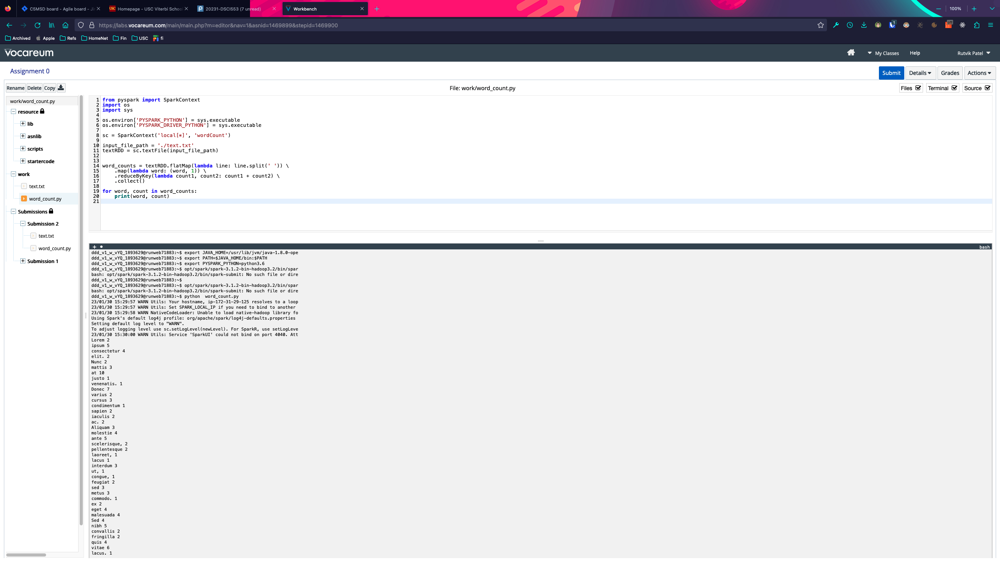

## Homework 0

The purpose of this homework is to get familiar with Vocareum Lab infrastructure and the
environment to be used to run the project submission on.

To run the programs on Vocareum terminal the following steps are needed:

1. Set Java version to 1.8 using: ```export JAVA_HOME=/usr/lib/jvm/java-1.8.0-openjdk-amd64```
2. Then add the path to the environment variables: ```export PATH=$JAVA_HOME/bin:$PATH```
3. Set the PySpark Python version to 3.6, do this by entering ```export PYSPARK_PYTHON=python3.6```
4. Upload the files with code in the work section in the workspace area.
5. Finally, run you script script.py using the following command: ```python word_count.py```. If that doesn't run, try:
```
opt/spark/spark-3.1.2-bin-hadoop3.2/bin/spark-submit --executor-memory 4G --driver-memory 4G script.py
```

Demo run example:



To run the files locally, perform the following steps:
1. Install JDK 1.8.
2. Install Spark Hadoop for mac and set ```SPARK_HOME```, ```HADOOP_HOME``` environment variables to the spark root directory and the hadoop root directory respectively.
3. Install python 3.6 ([ref. here](https://github.com/pyenv/pyenv/issues/1768#issuecomment-1403097990)) though newer versions may work.
4. Alternatively, refer [this](https://www.youtube.com/watch?v=5gFGVDqEYeY) video.
5. Run the program using ```python word_count.py```. 