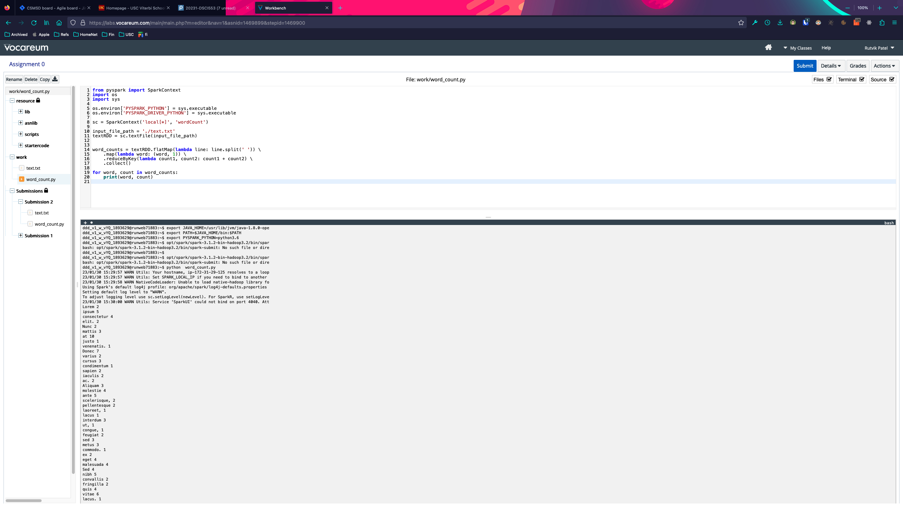
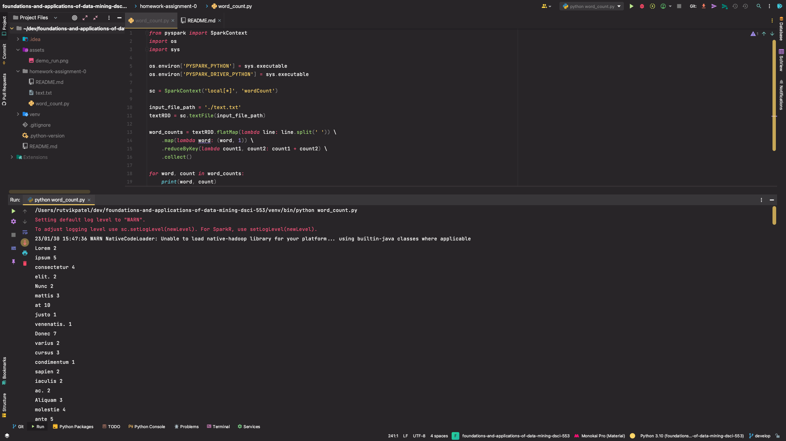
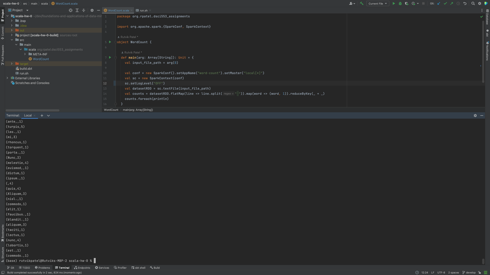

## Homework 0: Word Count of a File using Map-Reduce

The purpose of this homework is to get familiar with Vocareum Lab infrastructure and the
environment to be used to run the project submission on.

### To run the python programs on Vocareum terminal the following steps are needed:

1. Set Java version to 1.8 using: ```export JAVA_HOME=/usr/lib/jvm/java-1.8.0-openjdk-amd64```
2. Then add the path to the environment variables: ```export PATH=$JAVA_HOME/bin:$PATH```
3. Set the PySpark Python version to 3.6, do this by entering ```export PYSPARK_PYTHON=python3.6```
4. Upload the files with code in the work section in the workspace area.
5. Finally, run you script script.py using the following command: ```python word_count.py```. If that doesn't run, try:
```
opt/spark/spark-3.1.2-bin-hadoop3.2/bin/spark-submit --executor-memory 4G --driver-memory 4G script.py
```
6. Alternatively, execute ```./run.sh```.

Vocareum demo run example:



### To run the python files locally, perform the following steps:
1. Install JDK.
2. Install Spark Hadoop for mac and set ```SPARK_HOME```, ```HADOOP_HOME``` environment variables to the spark root directory and the hadoop root directory respectively.
3. Install python 3.6 ([ref. here](https://github.com/pyenv/pyenv/issues/1768#issuecomment-1403097990) for macs with M series chips) though newer versions may work.
4. Alternatively, refer [this](https://www.youtube.com/watch?v=5gFGVDqEYeY) video.
5. Run the program using ```python word_count.py```.

### Versions 
```
JDK - 1.8 (jdk1.8.0_361.jdk)
SPARK - 3.3.1 (spark-3.3.1-bin-hadoop3)
python - 3.6 or (3.x > 3.6 but some syntax might not work on vocareum)
```

Local demo run example:



### To run Scala program locally, build the artifacts (jars) and use the following command:
```
./run-local.sh --class org.rpatel.dsci553_assignments.WordCount ./out/artifacts/scala_hw_0_jar/scala-hw-0.jar ../text.txt
```

replace the ```spark-submit``` and ```.jar``` file output accordingly.

Local demo run example:



### Versions 
```
JDK - 1.8 (jdk1.8.0_361.jdk)
SPARK - 3.1.2 (spark-3.1.2-bin-hadoop3.2)
scala - 2.12.17 (sbt: org.scala-lang:scala-library:2.12.17:jar)
```

### Troubleshoot:
- Path not configured properly for spark or hadoop - add the following in ```~/.zshrc``` or ```~/.zprofile``` depending on whichever is used:
```
# Set env vars for spark and hadoop
export SPARK_HOME=/Library/spark-3.3.1-bin-hadoop3
export PYTHONPATH=/Library/spark-3.3.1-bin-hadoop3/python
```
- JDK is not available - add the following in ```~/.zshrc``` or ```~/.zprofile``` depending on whichever is used:
```
# Set env var for Java
export JAVA_HOME=/Library/Java/JavaVirtualMachines/liberica-jdk-8.jdk
```
or use the path of any other JDK distribution if multiple of them are installed.
- PORT is unassigned (Can't assign requested address: Service 'sparkDriver' failed after 16 retries) - Manually set ```SPARK_LOCAL_IP``` in ```/Library/spark-3.3.1-bin-hadoop3/bin/load-spark-env.sh``` using:
```
export SPARK_LOCAL_IP="127.0.0.1"
```
- For running with ```scala```, a completely different version is used for building the
```.jar```. This is done to make the versions compatible for scala development. Hence, everytime a job
is submitted to spark, first the correct environment variables are set in the ```./run.sh```
script. The project is set up in IntelliJ idea with the versions as described above.
For additional references on how to setup environment in IntelliJ refer the following links:
    - [Setup](https://youtube.com/watch?v=u0FLmrnAm5k&feature=shares)
    - [Config](https://www.jetbrains.com/help/idea/compile-and-build-scala-projects.html)
    - Make sure to set up the following:
      - Libraries with ```spark jars``` and scala compiler.
      - Project with correct ```JDK```.
      - Artifacts from module with dependencies with correct main class. 
